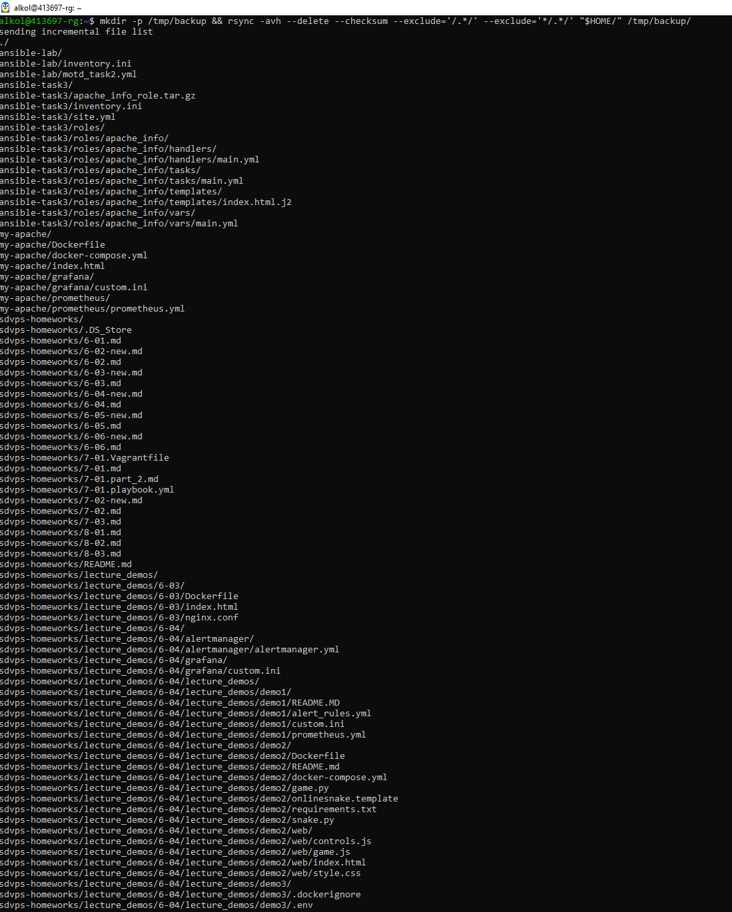
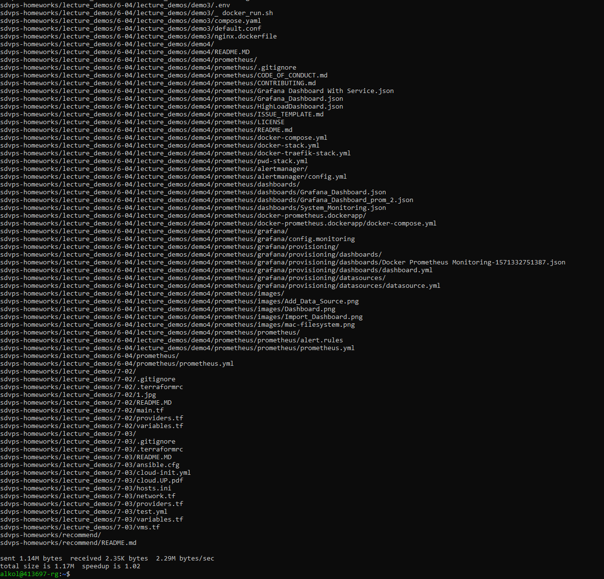
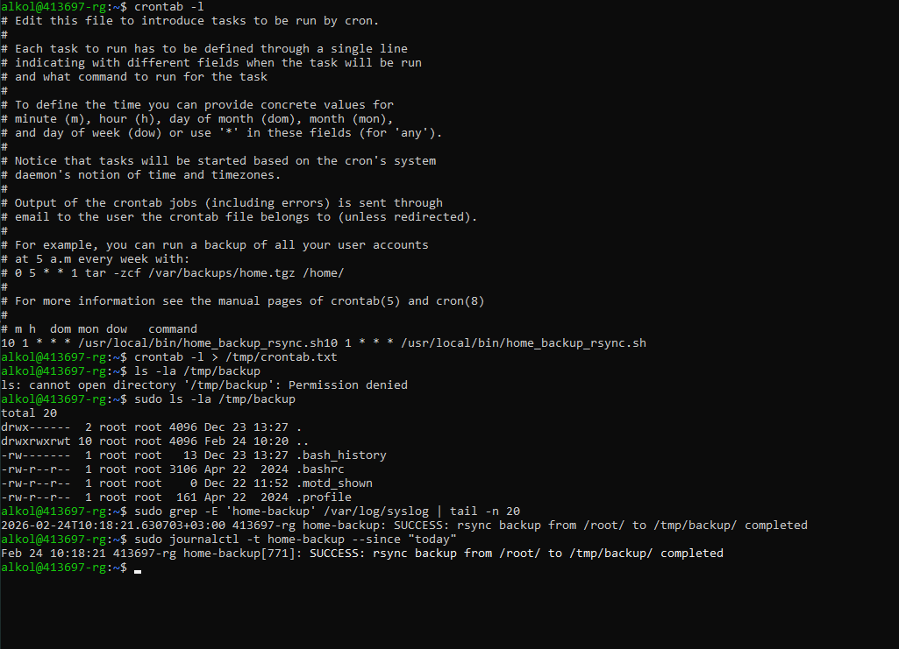

# Backup_homework

1# Disaster_recovery_Keepalived_homework_01. GitLab Runner

**Кolesnikov Aleksandr**  

## Задание 1

### Скриншот команды rsync 1

### Скриншот команды rsync 2

## Задание 2

### Скриншот работы скрипта

